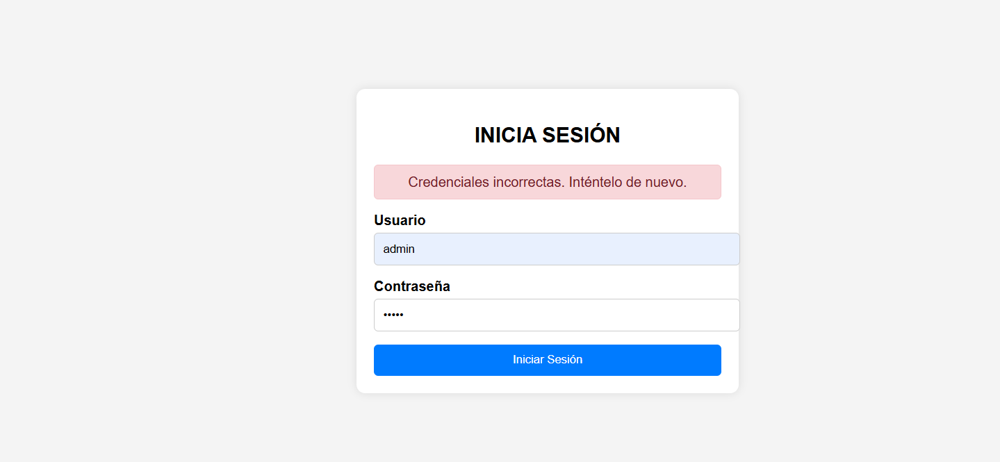
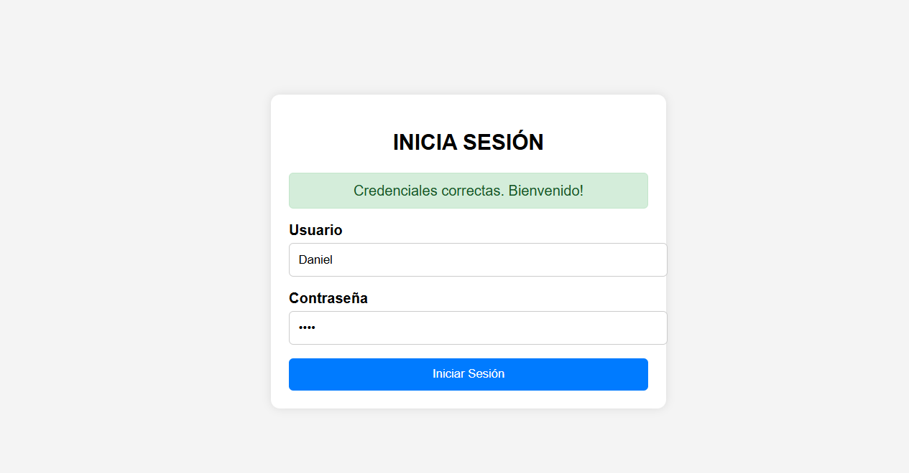
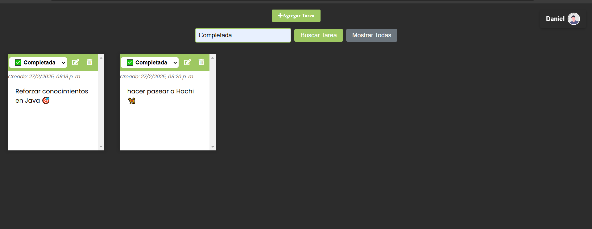
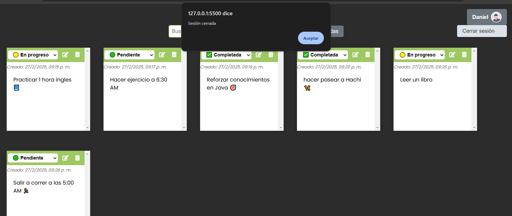

# Gestión de Tareas 📋

 Esta es una aplicación web diseñada para organizar y gestionar tus tareas de manera eficiente. Con una interfaz intuitiva, puedes crear, editar, eliminar y buscar tareas por estado. Además, cuenta con un sistema de autenticación para proteger tu información.

 ---

 ## Características principales ✨
- **Login de usuarios**: Permite la autenticación de usuarios para acceder a la aplicación, validando credenciales y almacenando el nombre de usuario en localStorage.
- **Gestión de tareas**: Crea, edita, elimina y busca tareas por estado.
- **Cierre de sesión**: Permite a los usuarios cerrar sesión de manera segura.
- **Interfaz intuitiva**: Tiene un diseño moderno y fácil de usar

---

## Capturas de pantalla 📸

### Página de Login

### **Credenciales incorrectas**
  Captura de la página de login cuando el usuario ingresa credenciales incorrectas. Muestra un mensaje de error: "Credenciales incorrectas. Inténtelo de nuevo.
  


### **Credenciales correctas**
  Captura de la página de login cuando el usuario ingresa credenciales correctas. Muestra un mensaje de bienvenida: "Credenciales correctas. Bienvenido!", y le redirige a la pagina index.html
  


### Página index (Gestión de tareas)
Captura de la página principal de la aplicación, donde se muestra una lista de tareas con su estado (Pendiente, En progreso, Completada) y la fecha de creación.También se observa un botón para agregar nuevas tareas y un campo donde puedes consultar las tareas por el nombre del estado


### Buscar Tareas por estado
- **Buscando Tareas con estado "Completada"**
Captura de la interfaz de búsqueda de tareas cuando se filtra por el estado "Completada". Muestra solo las tareas que tienen este estado


- **Buscando Tareas con estado "Progreso"**
Captura de la interfaz de búsqueda de tareas cuando se filtra por el estado "En progreso". Muestra solo las tareas que están en progreso


### Cerrar sesión
Captura del menú desplegable del usuario, donde se muestra la opción "Cerrar sesión". Al hacer clic en esta opción, el usuario es redirigido a la página de login, y su sesión se cierra correctamente.


---

## Tecnologías utilizadas 🛠️

- **Frontend**: HTML, CSS, JavaScript.
- **Librerías**: [Marked.js](https://github.com/markedjs/marked) para convertir Markdown en HTML.
- **Almacenamiento**: `localStorage` para guardar datos del usuario y tareas de forma persistente en el navegador.

---

## Cómo usar 🚀

### Requisitos 
- Un navegador web moderno (Chrome, Firefox, Edge, etc.).

### Instalación

1. Clona este repositorio:
   ```bash
   git clone https://github.com/Daniel-JA03/gestion-tareas.git


